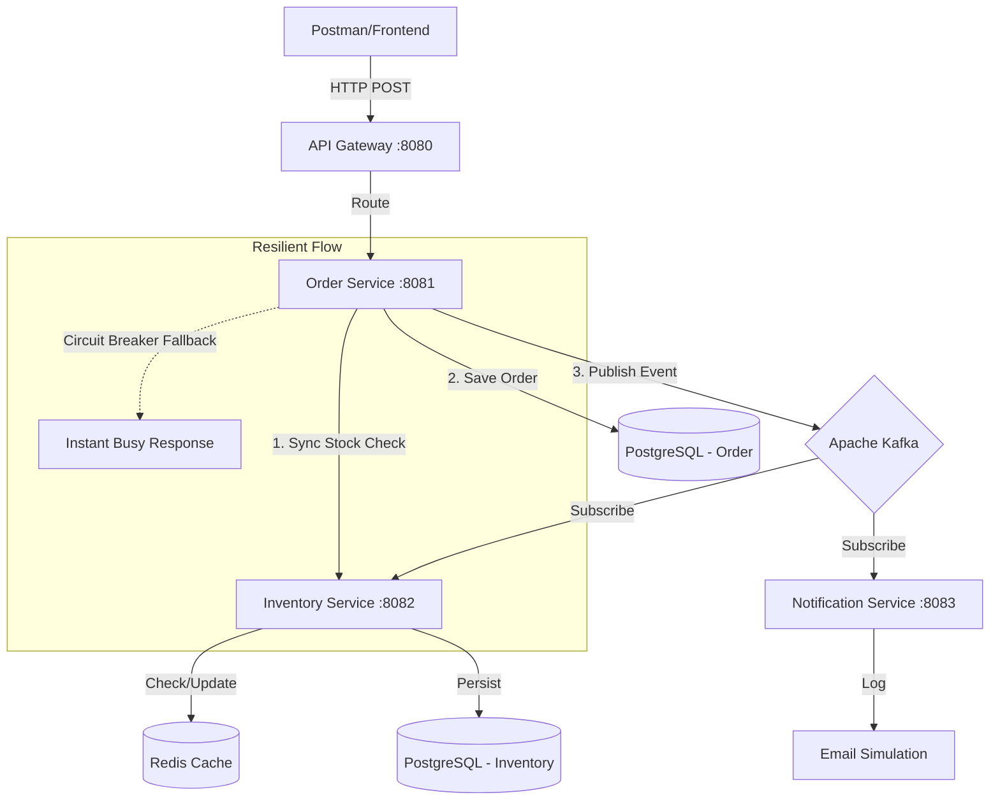

# 🚀 Spring Boot Kafka Redis Microservices Stack

[](https://spring.io/projects/spring-boot)
[](https://kafka.apache.org/)
[](https://redis.io/)
[](https://resilience4j.readme.io/)

A production-grade **E-Commerce Order Processing System** built with a modern Microservices architecture. This project is specifically designed to demonstrate how to handle extreme traffic spikes (e.g., **Flash Sales / Harbolnas**) using event-driven patterns, distributed caching, and resilient system design.

---

## 🏗️ System Architecture



---

## 🌟 Key Features & "Real-World" Justifications

### 1. **High-Speed Caching (Redis)**
Prevents database bottlenecks during traffic spikes. The system checks stock in memory (Redis) before hitting the primary database.

### 2. **Event-Driven Decoupling (Apache Kafka)**
Order completion is asynchronous. Once an order is saved, the UI responds immediately while stock reduction and notifications are handled in the background, ensuring a smooth user experience under heavy load.

### 3. **Fault Tolerance (Resilience4j)**
Implements the **Circuit Breaker** pattern. If the Inventory Service is slow or down, the Order Service won't hang; it provides an immediate fallback response, preventing a system-wide crash.

### 4. **API Gateway Pattern**
Centralized entry point for all requests, providing a clean API structure and a base for future security/rate-limiting implementation.

---

## 🛠️ Tech Stack
- **Backend:** Java 17, Spring Boot 3.2.5
- **Microservices:** Spring Cloud Gateway, Resilience4j
- **Messaging:** Apache Kafka & Zookeeper
- **Caching:** Redis
- **Database:** PostgreSQL (Multiple instances)
- **Containerization:** Docker & Docker Compose

---

## 🚀 Getting Started

### Prerequisites
- Docker & Docker Compose
- Java 17+
- Maven

### Running the Infrastructure
Start the required databases, Kafka, and Redis with a single command:
```bash
docker-compose up -d
```

### Building & Running Services
1. Build the monorepo:
   ```bash
   mvn clean install -DskipTests
   ```
2. Run each service in separate terminals or your IDE:
   - `api-gateway`
   - `order-service`
   - `inventory-service`
   - `notification-service`

---

## 🧪 Testing the System

Send a `POST` request to the API Gateway to place an order:

```bash
curl --location 'http://localhost:8080/api/orders' \
--header 'Content-Type: application/json' \
--data '{
    "skuCode": "iphone_15",
    "price": 15000000,
    "quantity": 1
}'
```

**Observation Points:**
- Check the **Order Service** log to see the Kafka message being published.
- Check the **Inventory Service** log to see the stock being reduced via Kafka consumer.
- Check the **Notification Service** log to see the email simulation.
- Stop the Inventory Service and try again to see the **Circuit Breaker** fallback in action!

---

Developed with ❤️ as a Professional Portfolio Project.
